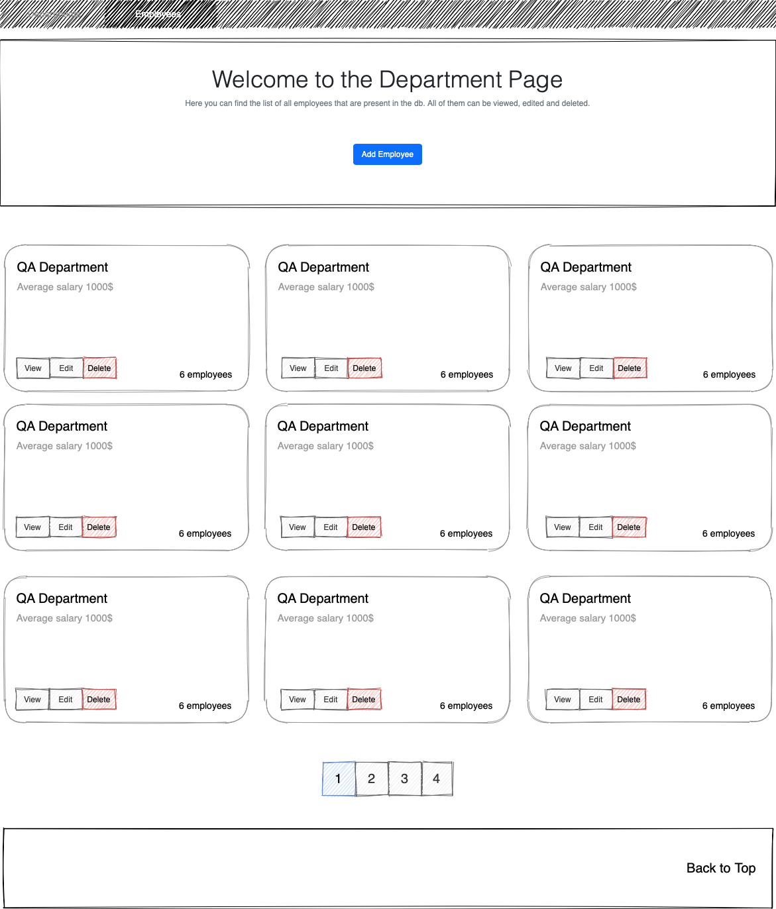
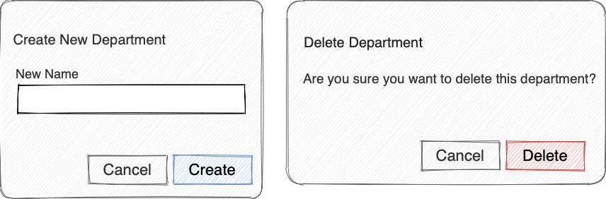
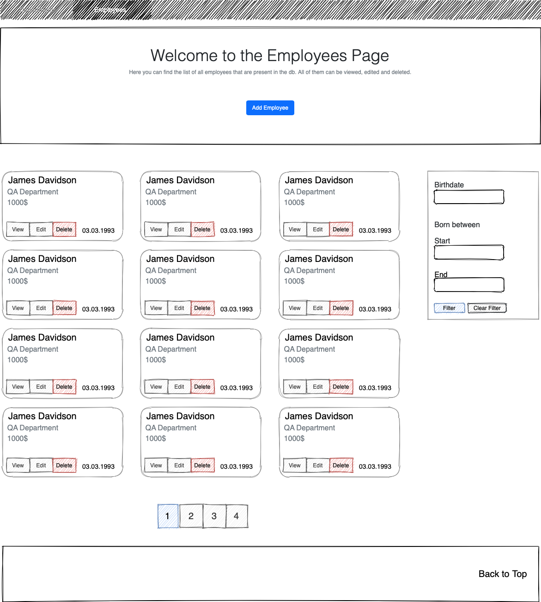
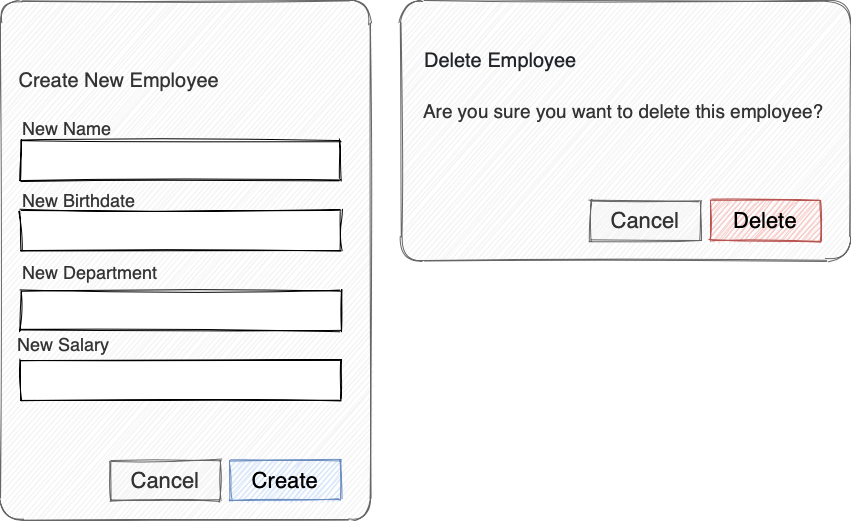
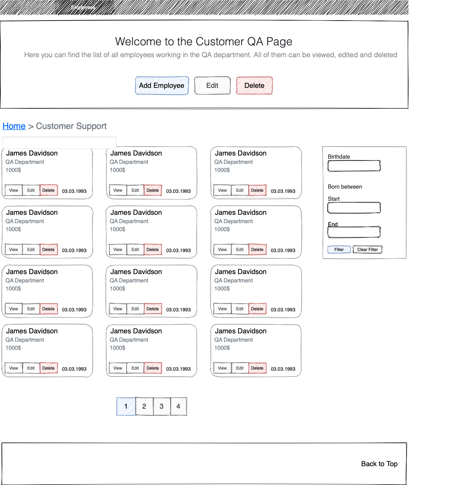
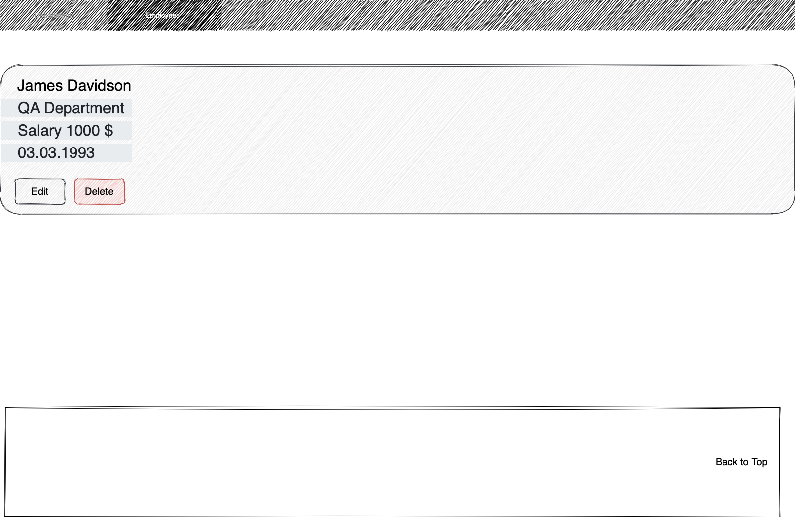
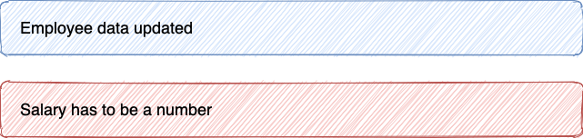
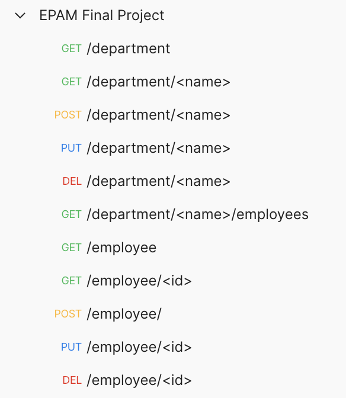
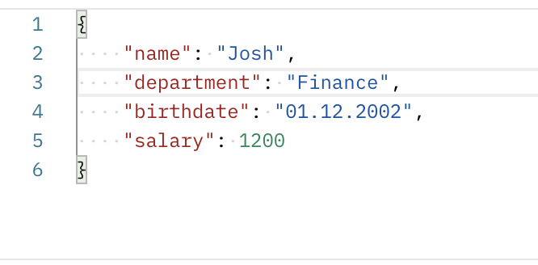

## 1.0 Introduction
___

### 1.1 Purpose  

The purpose of this document is to present a detailed description of the HR Panel System. It will explain the purpose and features of the system, the interfaces of the system, what the system will do, the constraints under which it must operate.

### 1.2 Scope of Project

The system is designed for the company’s HR department to organize the data about all the company employees in a single web app as well as make it easy to view, edit and delete aforementioned data.

User has to be able to work with the data about all the departments and workers in the company. The system can be used in any web browser or using a REST API. Frontend provides the user with a simple interface with all functions required for his work.

Project is provided with unit tests covering over 90% of the code. 

### 1.3 Overview of Document 

The next chapter describes use case for both web service and web application.

## 2.0 Overall Description of Web Application
___

### 2.1 Departments

On this page user can find data about different departments of the company.

Main scenario:
• User opens ‘departments’ page
• Application returns a list of all departments in the company

User is able to
• view a list of departments
• add a new department into the database 
• switch pages using pagination button to view more departments

Following information is shown for each department:
• Department name
• Average salary per department
• Number of employees

Data of every department can be edited or removed using these modals

### 2.2 Employees

This part of web service provides user with an ability to create, view, edit and delete employee table data as well as filter them by birthdate.

Main scenario:
• User opens ‘employees’ page
• Application returns a list of all company workers

User is able to
• view a list of employees with an indication of each employee data
• add a new employee into the database 
• switch pages using pagination button to view more employees
• search for employees born on a certain date or in the period of dates (all filtering is done on the frontend)

An employee card displays following information:
• Name 
• Department where they work
• Salary
• Birthdate

All these data can be edited using buttons that opens next modal windows

### 2.3 Department page

On this page user can find info about a particular department as well as about the personnel that works in it. 

Main scenario:
• User opens ‘departments’ page
• Application returns a list of all employees who work in the selected department

User is able to
• view a list of employees with an indication of each employee data
• add a new employee into the database 
• switch pages using pagination button to view more employees
• search for employees born on a certain date or in the period of dates (all filtering is done on the frontend)
• edit department data or delete it and all it workers from the database

### 2.4 Employee Page

On the employee page user can view and edit data about a particular employee. Web service uses the same modal windows as in the ‘employees’ page.

### 2.5 Additional Details

After changing or removing any employee or department an alert message will be shown. These can also appear when API returns an error code due to any reason, including when a user tries to set an invalid value to an object.

## 3.0 Overall Description of Web Service
___

Designed system also provides user with a REST API web service with the same functionality as the web application.

User can run CRUD operation using curl or any other client tool such as Postman.

These are available API routes

When updating some object data via PUT request user has to specify new data in the body of the request.

